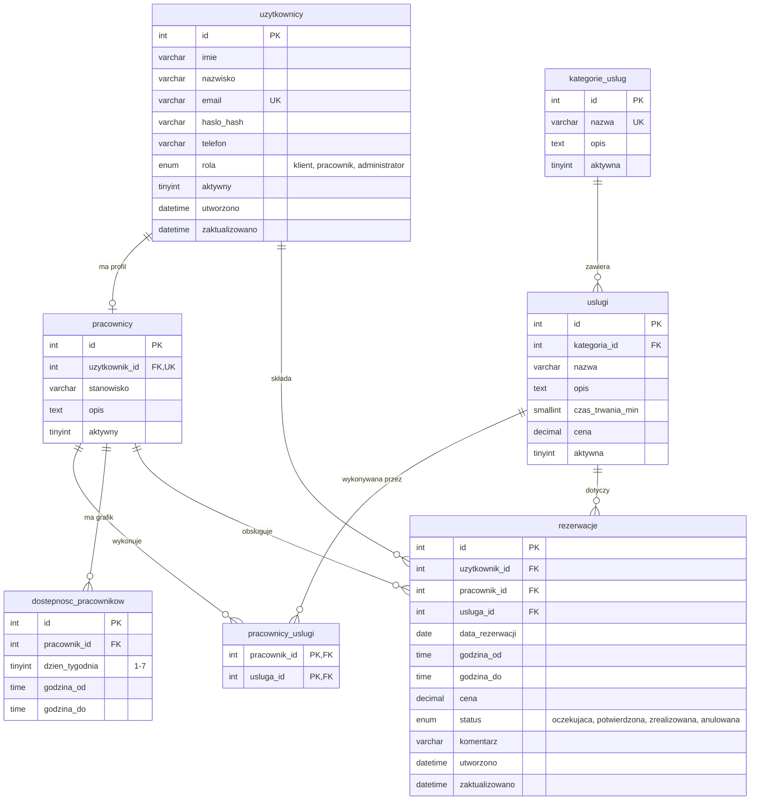

# SwissCar Import – system rezerwacji usług

# Autorzy

Imie i Nazwisko / GitHub
Jan Wodzyński / jwodz
Maciej Bieliński / Makro201
5KT

# Opis systemu

SwissCar Import to strona internetowa dla firmy, która sprowadza samochody ze Szwajcarii do Polski. Klient może zobaczyć ofertę i zarezerwować termin u wybranego pracownika, np. na konsultację, sprawdzenie historii auta po numerze VIN, przygotowanie dokumentów do cła, pomoc w rejestracji auta albo odbiór auta.

Sprowadzenie auta trwa kilka tygodni, dlatego w systemie rezerwuje się pojedyncze etapy. Każdy etap to spotkanie lub usługa, która trwa określony czas i jest wykonywana przez konkretnego pracownika w jego godzinach pracy.

W systemie są trzy rodzaje użytkowników:

- **Klient** – zakłada konto, przegląda ofertę, rezerwuje termin (usługa → pracownik → data → godzina → potwierdzenie), widzi swoje rezerwacje, może anulować przyszłą rezerwację i zmienić dane w profilu.
- **Pracownik** – widzi swoje wizyty na dziś, przyszłe wizyty i historię oraz zmienia ich status.
- **Administrator** – zarządza użytkownikami, pracownikami, kategoriami, usługami i godzinami pracy, widzi wszystkie rezerwacje i statystyki.

# Technologie

- PHP
- HTML5, CSS3, JavaScript
- MySQL
- Git i GitHub

# Struktura repozytorium

```
README.md
.gitignore
/config
    config.example.php    – wzór pliku z ustawieniami (bez haseł)
/database
    database.sql          – baza danych z danymi testowymi
/docs
    erd.png               – schemat bazy danych
/public                   – pliki strony
    index.php
    /css
    /js
    /images
```

# Instrukcja uruchomienia

Potrzebny jest XAMPP (albo inny serwer z PHP i MySQL 8.0.16 lub nowszym).

1. Pobierz repozytorium do folderu `htdocs` w XAMPP.
2. W panelu XAMPP włącz **Apache** i **MySQL**.
3. Wejdź na `http://localhost/phpmyadmin`, otwórz zakładkę **Import** i wczytaj plik `database/database.sql`. Baza `swisscar_rezerwacje` utworzy się sama, razem z danymi testowymi.
4. Skopiuj plik `config/config.example.php`, nazwij kopię `config.php` i wpisz w niej dane do bazy (w XAMPP zwykle użytkownik `root` bez hasła).
5. Otwórz w przeglądarce: `http://localhost/NAZWA_KATALOGU/public/`

> Plik `config/config.php` nie trafia na GitHuba (jest w `.gitignore`), więc hasła do bazy nie są publiczne.

# Testowe dane logowania

Hasło do wszystkich kont: **`Test123!`**

| Rola | E-mail |
|---|---|
| Administrator | admin@swisscar.pl |
| Pracownik (doradca importowy) | marta.nowak@swisscar.pl |
| Pracownik (specjalista ds. dokumentów) | piotr.wisniewski@swisscar.pl |
| Pracownik (rzeczoznawca) | katarzyna.wojcik@swisscar.pl |
| Klient | jan.zielinski@example.com |
| Klient | ewa.lewandowska@example.com |
| Klient (konto nieaktywne) | robert.mazur@example.com |

Hasła w bazie są zaszyfrowane funkcją `password_hash()`, a nie zapisane zwykłym tekstem.

# Baza danych

# Diagram ERD



# Tabele

| Tabela | Co przechowuje |
|---|---|
| `uzytkownicy` | konta wszystkich użytkowników (klient, pracownik, administrator) |
| `kategorie_uslug` | kategorie usług |
| `uslugi` | usługi z ceną i czasem trwania |
| `pracownicy` | dodatkowe dane pracownika, połączone z jego kontem |
| `pracownicy_uslugi` | które usługi wykonuje który pracownik |
| `dostepnosc_pracownikow` | godziny pracy pracowników |
| `rezerwacje` | rezerwacje klientów i ich status |

# Relacje

- **1:N** (jeden do wielu) – kategoria → usługi, użytkownik → rezerwacje, pracownik → rezerwacje, usługa → rezerwacje, pracownik → godziny pracy
- **1:1** (jeden do jednego) – konto użytkownika → profil pracownika
- **N:M** (wiele do wielu) – pracownicy ↔ usługi, przez tabelę `pracownicy_uslugi`

# Najważniejsze decyzje projektowe

- **Ceny jako `DECIMAL(8,2)`** – typ `FLOAT` może źle zaokrąglać kwoty, a przy pieniądzach nie może być błędów.
- **Hasło w polu `VARCHAR(255)`** – zaszyfrowane hasło ma teraz ok. 60 znaków, ale w przyszłości może być dłuższe.
- **Cena zapisana w rezerwacji** – gdy administrator zmieni cenę usługi, stare rezerwacje zachowają cenę z dnia rezerwacji.
- **Dane nie są usuwane** – usługi, kategorie, pracowników i użytkowników można wyłączyć, a rezerwacje się anuluje. Dzięki temu nie tracimy historii rezerwacji.
- **Usuwanie powiązanych danych** – nie da się usunąć czegoś, do czego są przypisane rezerwacje (`RESTRICT`). Po usunięciu pracownika jego godziny pracy i przypisane usługi usuwają się same (`CASCADE`).
- **Zabezpieczenia w bazie**:
  - `UNIQUE` – nie mogą się powtórzyć: e-mail, nazwa kategorii, nazwa usługi w kategorii, profil pracownika dla tego samego konta, te same godziny pracy,
  - `CHECK` – czas usługi większy od 0 (max 480 min), cena nie mniejsza niż 0, dzień tygodnia od 1 do 7, koniec później niż początek,
  - `ENUM` – można wpisać tylko ustalone role i statusy rezerwacji.
- **Dzień tygodnia 1–7** – 1 to poniedziałek, 7 to niedziela.
- **Indeksy** (przyspieszają wyszukiwanie):
  - `rezerwacje (pracownik_id, data_rezerwacji, godzina_od)` – szukanie zajętych godzin pracownika w danym dniu,
  - `rezerwacje (data_rezerwacji, status)` – filtrowanie rezerwacji w panelu administratora,
  - `uslugi (kategoria_id, aktywna)` – pokazywanie aktywnych usług z wybranej kategorii.

# Dane testowe

W bazie są: 1 administrator, 3 pracowników z różnymi godzinami pracy (jeden ma przerwę), 5 klientów (jedno konto jest wyłączone), 4 kategorie, 11 usług (jedna wyłączona) oraz 13 rezerwacji z przeszłości i przyszłości, we wszystkich statusach. Dwie rezerwacje są jedna po drugiej (jedna kończy się, a druga zaczyna o 11:00), żeby pokazać, że takie terminy są dozwolone.

# Funkcje dodatkowe

Planowane (lista będzie uzupełniana):

- 
- 

# Postęp prac

| Etap | Termin | Zakres | Status |
|---|---|---|---|
| 1 | 25.09.2026 | Projekt, GitHub i baza danych | ✅ ukończony |
| 2 | 16.10.2026 | Użytkownicy i logowanie | ⏳ |
| 3 | 06.11.2026 | Panel administracyjny | ⏳ |
| 4 | 20.11.2026 | Klient i rezerwacje | ⏳ |
| 5 | 27.11.2026 | Kompletny projekt i prezentacja | ⏳ |
